# Project Structure

아래 구조는 실제 개발에 필요한 핵심 경로만 추려서 정리한 것입니다.  
`node_modules`, `dist`, 임시 파일은 제외했습니다.

```mermaid
flowchart TD
    mkMath["mkMath/"]
    kids["kids-game/"]
    src["src/"]
    actionarea["actionarea/"]
    spaceship["spaceshipbattle/"]
    robot["robot/"]
    logic["logic/"]
    generators["generators/"]
    components["components/"]
    common["common/"]
    hooks["hooks/"]
    constants["constants/"]
    assets["assets/"]
    coins["coins/"]

    mkMath --> kids
    kids --> indexHtml["index.html"]
    kids --> packageJson["package.json"]
    kids --> viteConfig["vite.config.js"]
    kids --> src

    src --> app["App.jsx"]
    src --> main["main.jsx"]
    src --> mainLayout["MainGameLayout.jsx"]
    src --> stageGame["StageGameScreen.jsx"]
    src --> stageGameCss["StageGameScreen.css"]
    src --> selection["SelectionScreen.jsx"]
    src --> stageMap["StageMap.jsx"]
    src --> stageMapCss["StageMap.css"]
    src --> partService["PartService.js"]
    src --> indexCss["index.css"]
    src --> appCss["App.css"]
    src --> actionarea
    src --> logic
    src --> components
    src --> hooks
    src --> constants
    src --> assets
    src --> coins

    actionarea --> spaceship
    actionarea --> robot

    spaceship --> spaceshipBattle["SpaceshipBattle.jsx"]
    spaceship --> spaceshipBattleCss["SpaceshipBattle.css"]
    spaceship --> healthBar["HealthBar.jsx"]
    spaceship --> healthBarCss["HealthBar.css"]
    spaceship --> comboEffect["ComboEffect.jsx"]
    spaceship --> comboEffectCss["ComboEffect.css"]

    robot --> robotAction["ActionArea.jsx"]
    robot --> robotActionCss["ActionArea.css"]
    robot --> robotCharacter["RobotCharacter.jsx"]

    logic --> inputArea["InputArea.jsx"]
    logic --> inputAreaCss["InputArea.css"]
    logic --> questionArea["QuestionArea.jsx"]
    logic --> questionAreaCss["QuestionArea.css"]
    logic --> questionFactory["QuestionFactory.js"]
    logic --> generators

    generators --> mathGen["MathGenerator.js"]
    generators --> engGen["EnglishGenerator.js"]
    generators --> hanjaGen["HanjaGenerator.js"]

    components --> verticalQuestion["VerticalQuestion.jsx"]
    components --> verticalMathCss["VerticalMath.css"]
    components --> common
    common --> battleShipSprite["battleShipSprite.jsx"]

    hooks --> useGameLogic["useGameLogic.js"]
    hooks --> useSpaceBattleLogic["useSpaceBattleLogic.js"]

    constants --> battleShipData["battleShipSpriteData.js"]
    assets --> hero["hero.png"]
    assets --> images["images/battleShipImg.png"]
    coins --> coinContext["CoinContext.jsx"]
```

## Quick Map

- `App.jsx`
  앱 진입점. 현재는 `SelectionScreen`과 `StageGameScreen` 사이를 전환합니다.

- `StageGameScreen.jsx`
  실제 게임 플레이 화면. 4분할 레이아웃, 문제 생성, 입력 처리, 우주선 배틀 액션을 연결합니다.

- `MainGameLayout.jsx`
  타이머 5%, 액션 30%, 문제 30%, 입력 35%의 메인 분할 레이아웃입니다.

- `actionarea/spaceshipbattle/`
  우주선 전투 액션 화면 관련 컴포넌트 모음입니다.

- `logic/`
  문제 영역, 입력 영역, 문제 생성 팩토리와 과목별 생성기를 관리합니다.

- `hooks/useSpaceBattleLogic.js`
  HP, 승패, 액션 상태, 콤보 등 전투 상태를 담당합니다.

- `coins/CoinContext.jsx`
  전역 코인 상태를 위한 Context입니다.

- `constants/battleShipSpriteData.js`
  우주선/미사일/이펙트 스프라이트 좌표 데이터입니다.
